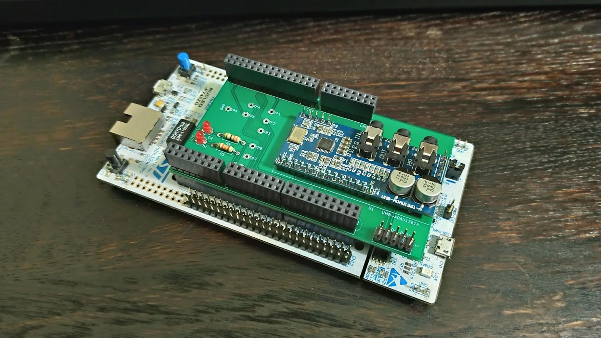

# murasaki_samples_audio
Audio Sample projects for STM32CubeIDE

## Table of contents
* [Requirement](#requirement)
* [Usage](#usage)
* [Install](#install)
* [License](#license)
* [Author](#author)

## Description
A collection of the Audio sample project for [murasaki](https://github.com/suikan4github/murasaki) project. 

The contents of this repository are collection of the STM32 CubeIDE projects. Each projects demonstrate the audio application by murasaki project. Recently, there is only one type of audio demonstration application. A talkthrough application which copies line-in audio signal to the headphone-out signal by digital domain. 

## Requirement
- Ubuntu 16.04 LTS
- [STM32 CubeIDE v1.1.0](https://www.st.com/en/development-tools/stm32cubeide.html)
- [Nucleo 144](https://www.st.com/ja/evaluation-tools/stm32-nucleo-boards.html). See below the actual name of the board. 
- [UMB-ADAU1361-A](http://dsps.shop-pro.jp/?pid=82798273) board
- [Akashi-02](https://github.com/suikan4github/Akashi-02) board to interface between the UMB-ADAU1361-A and Nucleo 144.

## Usage
Following samples are available. 

### nucleo-f722-144-akashi02-talkthrough
A project for [Nucleo F722ZE](https://www.st.com/content/st_com/ja/products/evaluation-tools/product-evaluation-tools/mcu-mpu-eval-tools/stm32-mcu-mpu-eval-tools/stm32-nucleo-boards/nucleo-f722ze.html). The audio signal to Line-in is copied to HP-out.

### nucleo-f746-144-akashi02-talkthrough
A project for [Nucleo F746ZG](https://www.st.com/content/st_com/ja/products/evaluation-tools/product-evaluation-tools/mcu-mpu-eval-tools/stm32-mcu-mpu-eval-tools/stm32-nucleo-boards/nucleo-f746zg.html). The audio signal to Line-in is copied to HP-out.

### Description
In these demonstrations, audio is processed in the [TaskBodyFunction() of murasaki_platform.cpp](https://github.com/suikan4github/murasaki_samples_audio/blob/f5f244cac2e12f1a8772ab1323214e0768015867/nucleo-f722-144-akashi02-talkthrough/Core/Src/murasaki_platform.cpp#L605). This function is running as independent FreeRTOS task at realtime priority. Algorithm of this task is very simple. It start and un-mute the codec. And then do the copy from input to output forever. 

## Install
1. Install the [Egit](https://www.eclipse.org/egit/) to CubeIDE by Menu bar -> Help -> Eclipse Marketpalace...
1. Clone [this repository](https://github.com/suikan4github/murasaki_samples_audio.git). Refer [the appropriate section in the Egit documentation](https://wiki.eclipse.org/EGit/User_Guide#Cloning_Remote_Repositories) to understand how to clone a repository.
1. Import the audio demo project(s) from git repository to workspace. Refer [the appropriate section in the Egit Documentation](https://wiki.eclipse.org/EGit/User_Guide#Starting_from_existing_Git_Repositories).
1. Build and run

For more information of importing, Refer [Murasaki Samples](https://github.com/suikan4github/murasaki_samples) project. 

## License

[MIT](LICENSE)

## Author

[suikan4github](https://github.com/suikan4github)
